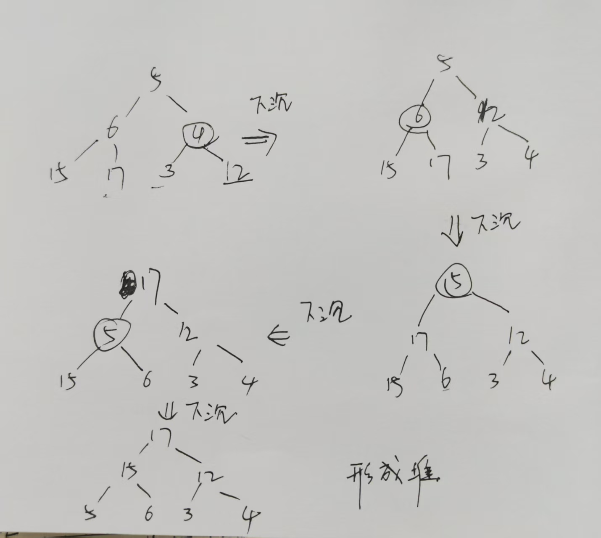
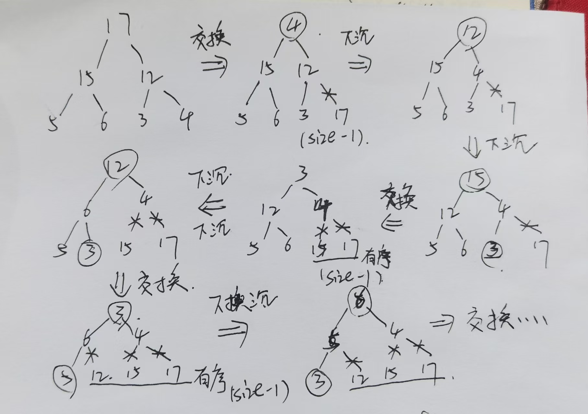
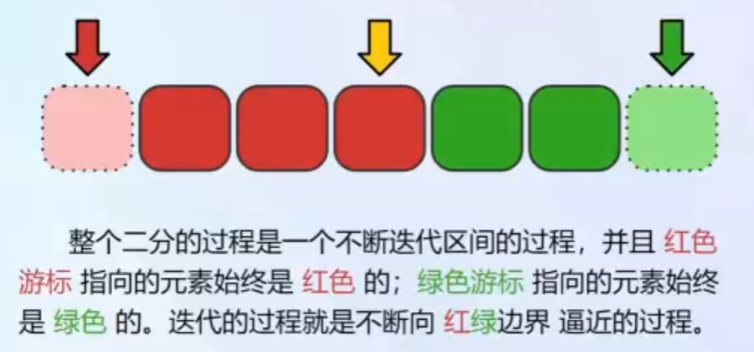
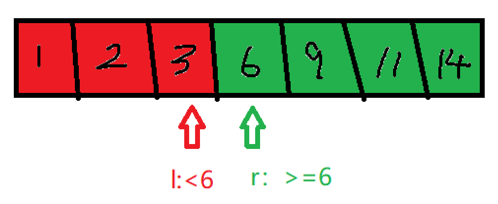

#CPP算法

记录一些C++用到的一些基本的算法

## 线性枚举

📝 **线性查找(线性枚举)**：就是**从头开始遍历元素，挨个进行比较**。简单有效，用于开拓思路，但效率低下，时间复杂度为$O(nm)$。n对应线性表的长度，m对应每次操作所需要操作的量级。

🏗️ **常见的应用场景**：求最大值/最小值、求和、求平均值、判断是否存在某个值等。

```cpp
function getMax(arr_num, arr) // 求最大值
{
    max_val = -inf;
    for i -> [0, arr_num-1]
    {
        if arr[i] > max_val
            max_val = arr[i];
    }
    return max_val;
}
function getSum(arr_num, arr)   // 求和
{
    sum_val = 0;
    for i -> [0, arr_num-1]
    {
        sum_val += arr[i];
    }
    return sum_val;
}
```

## 模拟

📝 模拟算法没有特定的算法框架，就是根据问题需要，逐步实现题目要求的功能。
通常用于实现题目中描述的过程，或者直接按照题目要求进行操作。
模拟题重要的是选择合适的数据结构，然后根据问题来实现相应的功能，常见的数据结构有：数组、字符串、矩阵、二叉树、链表等。

示例：
给定一个非负整数 num，反复将**各个位上的数字相加**，直到**结果为一位数**。返回这个结果。
如输入: num = 38，输出: 2 
解释: 各位相加的过程为：

- 38 --> 3 + 8 --> 11
- 11 --> 1 + 1 --> 2

由于 2 是一位数，所以返回 2。
 
```cpp
int addDigits(int num) {
    while(num >= 10)  // 一个循环直到num为一位数
    {
        int sum = 0;  // 实现将num = 各个位数相加
        while(num)
        {
            sum += num%10;
            num = num/10;
        }
        num = sum;
    }
    return num;     // 满足条件的话即可返回
}
```

## 递推

递推是动态规划的基础，递推是通过已知的初始条件和递推关系，逐步计算出后续的结果。递推通常用于解决具有重叠子问题和最优子结构性质的问题。最通俗的理解就是数列，递推和数列的关系就如同算法和数据结构，数列如线性表，而递推就是一个循环或者迭代的枚举过程。
接下来列举几个经典的递归问题：

### 斐波那契数列
该数列前两项为0和1，后续每一项为前两项之和，即$F(0)=0, F(1)=1, F(n)=F(n-1)+F(n-2) (n>=2)$。
由于斐波那契数列的增长速度很快(指数级别的增长)，所以再实际使用的时候，一般不会超过30项，int类型存储范围有限。那么我们可以使用cpp来实现一下数列的递推过程。

```cpp
int fibonacci[31] = {0, 1}; // 定义数组

for (int i = 2; i<=30; i++)
{
    fibonacci[i] = fibonacci[i-1] + fibonacci[i-2]; // 递推关系
}
```

### 泰波那契数列

该数列前3项为0,1,1，后续每一项为前三项之和，即$T(0)=0, T(1)=1, T(2)=1, T(n)=T(n-1)+T(n-2)+T(n-3) (n>=3)$。

```cpp
int tribonacci[31] = {0, 1, 1}; // 定义数组
for (int i = 3; i<=30; i++)
{
    tribonacci[i] = tribonacci[i-1] + tribonacci[i-2] + tribonacci[i-3]; // 递推关系
}
```

### 基于斐波那契数列的变种问题

给定一个45节台阶的楼梯，一开始再第0阶，每次可以向上爬1阶或者2阶，问有多少种不同的方式可以爬到第45阶？

**分析一下**：由于每次只能爬1阶或者2阶，那么到达第n阶的方法数等于到达到达第n-1阶和第n-2阶的方法之和。
初始条件为$f(0)=1,f(1)=1$，按此递推即可得到f(45)的值。

### 二维递推问题

像斐波那契数列这种一维递推问题比较简单，有时候一维解决不了，这时候我们需要升高一个维度来看问题。

给定一个m行n列的网格，起始位置在左上角(0,0)，目标位置在右下角(m-1,n-1)，每次只能向下或者向右移动一步，问有多少种不同的路径可以到达目标位置？

🔍 **分析一下**：到达位置$(i, j)$的方法数等于到达位置$(i-1, j)$和$(i, j-1)$的方法数之和。
初始条件为$f(0,0)=1$，第一行和第一列的位置只能通过一种方式到达(一直向右或者一直向下)因此为1，只要将数据存储至二维数组上，该问题按此递推即可得到$f(m-1,n-1)$的值。

```cpp
// 假如m = 10， n = 10
int grid[10][10] = {0};
for (int i = 0; i < m; i++) grid[i][0] = 1; // 第一列置1
for (int j = 0; j < n; j++) grid[0][j] = 1; // 第一行置1

for (int i = 1; i < 10; i++)
{
    for (int j = 1; j < 10; j++)
    {
        grid[i][j] = grid[i-1][j] + grid[i][j-1]; // 递推关系
    }
}
return grid[9][9];
```

长度为n(1<=n<=40)的只由'A'、'C'、'M'三种字符组成的字符串，禁止出现'M'字符相邻的情况，问这样的串有多少种？

**分析一下**：以'A'字符结尾的为$f[n][0]$种，以'C'字符结尾的为$f[n][1]$种，以'M'字符结尾的为$f[n][2]$种。则共有$f[n][0]+f[n][1]+f[n][2]$种。
则长度为n的字符方法可以由长度为n-1的字符方法求得
$$
f[n][0] = f[n-1][0] + f[n-1][1] + f[n-1][2]\\
f[n][1] = f[n-1][0] + f[n-1][1] + f[n-1][2]\\
f[n][2] = f[n-1][0] + f[n-1][1]（不能连续出现'M'）
$$
进行统分
$$
f[n][0] = f[n][1] = \sum_{i=0}^2 f[n-1][i] \\
f[n][2] = f[n-1][0] + f[n-1][1] = 2\sum_{i=0}^2 f[n-2][i]
$$
因此$f[n] = f[n][0] + f[n][1] + f[n][2]$ 可以表示为
$$
f[n] = \sum_{i=0}^2 f[n][i] = 2\sum_{i=0}^2 f[n-1][i] + 2\sum_{i=0}^2 f[n-2][i]
$$
为了简化表示
$$
令 g[n] = \sum_{i=0}^2 f[n][i]
$$
因此$g[n] = 2g[n-1] + 2g[n-2]$

我们再想一下初始条件（手算出长度为1，2的方案数）:
$$
f[1][0] = 1, f[1][1] = 1, f[1][2] = 1;\\
g[1] = \sum_{i=0}^2 f[1][i] = 3;\\
g[2] = \sum_{i=0}^2 f[2][i]\\
     = f[2][0] + f[2][1] + f[2][2]
     = 3 + 3 + 2 = 8
$$

因此可以写下如下的程序：

```cpp
int g[41] = {0};
g[1] = 3, g[2] = 8;
for (int i = 3; i<41; i++)
{
    g[i] = 2*g[i-1] + 2*g[i-2];
}
return g[40];
```

所以对于解决递推问题的关键在于找到递推关系和初始条件，初始条件手算即可，而递推关系需要根据题目(每次移动的要求和对应的终止条件)

## 选择排序

选择排序(selection sort)是一种简单直观的排序算法。它首先**在未排序序列中找到最小(最大元素)**，放置到排序序列的起始位置(末尾位置)。然后从剩余未排序元素中继续寻找最小(最大)元素，放置到已排序序列的末尾。以此类推，直到所有元素均排序完毕。

分析一下时间复杂度：选择排序中，当$i=0$时，需要比较n-1次，当$i=1$时，需要比较$n-2$次，依次类推，直到$i=n-2$时，需要比较1次。因此总的比较次数为$(n-1)+(n-2)+...+1 = n(n-1)/2$，时间复杂度为$O(n^2)$。
空间复杂度：只是用了一个临时变量来进行存储交换，因此空间复杂度为$O(1)$。

因此很明确了，选择排序不适合大规模数据的排序，一般用于小规模数据的排序。
优化：每次循环里面都包含一个小循环来寻找最小值（区间最值问题），通过线性树（线性模拟树）来优化，时间复杂度可以降低到$O(nlogn)$。

## 冒泡排序

冒泡排序(Bubble Sort)是一种简单的排序算法，通过多次比较和交换相邻的元素，将数组中的元素按升序或降序排列。
基本思想：每次遍历数组，比较两个相邻的元素，如果它们顺序错误，就把它们纠正(交换)过来。这样，经过一轮遍历后，最值元素会“冒泡”到数组的末尾。重复这个过程，直到整个数组有序。

- 遍历数组第一个元素到最后一个元素
- 对每一个元素，和下一个元素进行比较
- 如果顺序错误，就把这两个元素进行交换

重复上述过程，直到所有元素都被遍历过一次。
时间复杂度和空间复杂度的计算和选择排序相似，再第一个元素，需要和$n-1$个元素进行比较，第二个元素需要和$n-2$个元素进行比较，因此总的比较次数为$(n-1)+(n-2)+...+1 = n(n-1)/2$，时间复杂度为$O(n^2)$。
空间复杂度：只是用了一个临时变量来进行存储交换，因此空间复杂度为$O(1)$。

若想优化冒泡排序，外层的循环是可以提前结束的，如果内循环的比较中没有发生交换，说明数组已经有序，可以提前结束排序过程。

```cpp 
// 冒泡排序的实现
// 5 4 3 2 1
void sort(vector<int>& v)
{
    int size = v.size();
    for (int i = 0; i<size-1; i++)
    {
        for (int j = 0; j<size-i-1; j++)
        {
            if (v[j] > v[j+1])
            {
                int temp = v[j];
                v[j] = v[j+1];
                v[j+1] = temp;
            }
        }
    }
}
```

## 插入排序

**插入排序**（**Insertion Sort**）是一种简单直观的排序算法，他的工作原理是通过构建有序序列，对于未排序的数据，在已排序序列中从后向前扫描，找到相应位置并插入，直到整个数组有序。

- 从第一个元素开始，将其视为已排序序列的第一个元素
- 遍历后面未排序元素，和已排序序列元素进行比较
- 从后向前进行比较，直到前一个元素小于排序元素(或到头)

经过一定轮次的比较移动之后，一定可以保证所有的元素都是升序排序。对于时间复杂度的计算，对于完全逆序的序列，往往需要比较(1+2+3+4+...+n-1) 因此时间复杂度为$O(n^2)$。空间复杂度为$O(1)$，因为交换往往是伴随一个数值元素的赋值。因此插入排序效率也是比较低的，不适合于大规模数据的排序。

若想优化算法，可以考虑算法中插入位置，快速找到插入位置从而降低时间复杂度，可以考虑二分查找。

```cpp
// 插入排序的实现
void sort(vector<int>& v)
{
    int size = v.size();
    for (int i = 1; i<size; ++i)
    {
        int index = i;
        for (int j = i-1; j>=0; j--)
        {
            if (v[index] < v[j])
            {
                int temp = v[index];
                v[index] = v[j];
                v[j] = temp;
                index = j;
            }
            else break;
        }
    }
}
```

## 计数排序

计数排序（Counting Sort）是一种基于哈希的排序算法。他的基本思想是通过统计每个元素的出现次数，然后根据统计结果将元素依次放入排序后的序列中。这种排序算法适用于元素范围较小的情况

- 初始化一个最大元素值+1的计数数组，所有元素初始化为0
- 遍历原始的数组，将每个元素的值作为索引，在计数数组中对应位置+1
- 将原数组清空
- 遍历计数器数组，按照数组中元素个数返回放置到原数组中

分析一下时间复杂度，初始化计数数组需要n，遍历数组需要n，遍历计数数组
空间复杂度比较高，需要数组的范围为最大值+1个大小的空间，因此不仅空间复杂度高，而且对数组值的范围有要求不能太大，并且有很多的空间浪费操作不必要的遍历。
优化访问：限制数组范围，数据为整数现定于[1,k]范围内，所以由于内存的限制，k不能过大
初始话数组可以使用系统函数，例如memset纯内存操作
排序元素时，记录插入元素的个数，当到达n时可以提前结束

```cpp
// 计数排序的实现 m为最大元素值
void intsort(vector<int>& v, const  int& m)
{
	const int size = v.size();
	int* nums = new int[m + 1];
	//for (int i = 0; i < m + 1; i++) nums[i] = 0;
	memset(nums, 0, sizeof(int) * (m + 1));
	
	for (const auto& n : v)
	{
		nums[n] += 1;	
	}
	v.clear();
	for (int i = 0; i <= m; i++)
	{
		v.insert(v.end(),nums[i], i);
	}
}
```

## 归并排序

归并的思想，将两个已经排序的序列合并成一个有序的序列。对于一个非有序的序列，可以拆成两个非有序的序列，然后分别调用归并排序，然会对两个有序序列在执行合并的过程。所以这里的归指的是递归，这里的并指的是合并。

时间复杂度分析：由于归并排序每次都将当前待排序的序列折半成两个子序列递归调用，然后再合并两个有序的子序列，而每次合并两个有序的子序列需要 $O(n)$ 的时间复杂度，所以我们可以列出归并排序运行时间 $T(n)$ 的递归表达式：
$$T(n)=2T(n/2)+O(n)$$
根据主定理我们可以得出归并排序的时间复杂度为 $O(nlogn)$
空间复杂度：$O(n)$。我们需要额外 $O(n)$ 空间的 tmp 数组，且归并排序递归调用的层数最深为 $log_2 n$，所以我们还需要额外的 $O(log n)$ 的栈空间，所需的空间复杂度即为 $O(n+logn)=O(n)$。


```cpp
void merge(vector<int>& v, int l, int m, int r)
{
    int n1 = m - l + 1;
    int n2 = r - m;
    vector<int> mv(n1 + n2);    // 一个新的列表来存储元素
    for (int i = 0; i<n1; i++) mv[i] = v[l+i];
    for (int i = 0; i<n2; i++) mv[i+n1] = v[i + m + 1];

    int i = 0, j = n1, k = l;
    while(i < n1 && j < n1+n2)
    {
        if (mv[i] <= mv[j]) v[k++] = mv[i++];
        else v[k++] = mv[j++];
    }
    // 将未遍历到的元素更新到列表中
    while(i < n1) v[k++] = mv[i++];
    while(j < n1+n2) v[k++] = mv[j++];
}
// 输入列表 左 右索引 注意都是闭区间
void sort(vector<int>& v, int l, int r)
{
    if (l >= r) return;
    int m = (r + l)/2; // 中间索引
    sort(v, l, m);      // 归
    sort(v, m+1, r);
    merge(v, l, m, r);  // 并
}
```

趁热打铁，再写一下链表的归并排序

```cpp
// 左闭右开区间
ListNode* sort(ListNode* head, ListNode* end)
{
    if (head == end || head == nullptr) return nullptr;
    if (head->next = end) // 如果只有两个节点
    {
        head->next = nullptr;
        return head;
    }
    ListNode *fast = head, *slow = head;
    while(fast != end)
    {
        fast = fast->next;
        slow = slow->next;
        if (fast != end) fast = fast->next;
    }
    ListNode* mid = slow;
    return merge(sort(head, mid), sort(++mid, end));
}
ListNode* merge(ListNode* head1, ListNode* head2)
{
    ListNode* ret = new ListNode(0);// 构造新的链表节点
    ListNode* temp = ret, *temp1 = head, *temp2 = head2;
    while(temp1 != NULL && temp2 != NULL)
    {
        if (temp1->val <= temp2->val)
        {
            temp->next = temp1;
            temp1 = temp1->next;
        }else
        {
            temp->next = temp2;
            temp2 = temp2->next;
        } 
        temp = temp->next;
    }
    if (temp1 != NULL)
    {
        temp->next = temp1;
    }
    if (temp2 != NULL)
    {
        temp->next = temp2;
    }
    return ret->next;
}
```

## 快速排序

快速排序(Quick Sort)是一种分而治之的排序算法，它通过选择 一个基准元素，将数组分为两个部分，一个部分都比基准小，另一个部分的元素都比基准大，然后对这两个部分在进行快速排序，最终得到有序的数组。具体步骤如下：

- 选择基准元素，从数组中选择一个元素作为基准
- 分割数组：将比基准小的元素放置到基准的坐标，将比基准大的元素放置到基准的右边
- 递归排序，对基准左边和右边的子数组分别进行快速排序
- 重复上述操作，直到子数组的长度变为0或者1

时间复杂度：**最优的情况为每次选择的基准元素正好将数组分为两等分**时，快速排序的时间复杂度为$O(nlogn)$。最坏的情况为当每次选择的基准元素是最大或最小元素时，快速排序的时间复杂度为$O(n^2)$
快速排序的空间复杂度是$O(logn)$，因为在递归调用中需要使用栈来存储中间结果，这意味着在排序的过程中，最多需要$O(logn)$的额外空间来保存递归调用的栈帧。

```cpp
int partition(vector<int>& v, int l, int r)
{
    int idx = l + rand()%(r - l + 1);
    swap(v[l], v[idx]);
    int i = l, j = r, x = v[l];
    while(i < j)
    {
        while(i < j && x < v[j]) j--;
        if (i < j) swap(v[j], v[i]), i++;
        while(i < j && x > v[i]) i++;
        if (i < j) swap(v[j], v[i]), j--;
    }
    return i;
}
void QuickSort(vector<int>& v, int l, int r)
{
    if (l >= r) return;
    int quick_index = partition(v, l, r);
    QuickSort(v, l, quick_index-1);
    QuickSort(v, quick_index+1, r);
}
```

## 桶排序

桶排序(Bucket Sort) 是一种基于计数的排序算法，工作原理是将数据分到有限数量的桶子里，然后每个桶再分别排序（有可能再使用别的排序算法或是以递归方式继续使用桶排序进行排序）

算法思想：

- 设置固定数量的空桶
- 把数据放置到对应的桶中
- 对每个不为空的桶中的数据进行排序
- 拼接不为空的桶中的数据，得到结果

复杂度分析：时间复杂度，因为桶排序还需要使用排序算法对桶中的元素进行排序，所以时间复杂度的计算还依赖于采用什么排序方法。空间复杂度，需要将元素放置到桶中，需要存储n个元素到空间中。

```cpp
#define ArrayType char
vector<vector<Arraytype>> bucket;
vector<int> count;

void BucketSort(ArrayType* arr, int n, int max)
{
    bucket.clear();
    count.resize(max);
    for (int i = 0; i<max; i++) count[i] = 0;
    for (int i = 0; i<n; i++) count[arr[i]]++;
    for (int i = 0; i<max; i++) bucket.push_back({});
    // 将元素放置到对应的桶中
    for (int i = 0; i<max; i++)
    {
        bucket[count[i]].push_back(i);
    }
    // 可选择算法对桶中的元素进行排序
    for (int i = 0; i<max; i++)
    {
        if (bucket[i].size() <= 1) continue;
        sort(bucket[i]);    // 进行排序
    }
}
```

## 基数排序

基数排序（Radix Sort）是一种非比较型排序算法，根据数字的每一位来进行排序。通常用于整数排序，基数排序的基本思想是通过对所有元素进行若干次“分配”和“收集”操作来实现排序。

算法的思想为：

- 获取待排序元素的最大值，并确定其位数
- 从低位数开始，依次对所有元素进行“分配”和“收集”操作
- 在每一位上，根据该位上数字的值将元素分配到相应的桶中
- 对每个桶中的元素进行顺序排序，得到排序后的部分结果
- 重复上述的步骤，直到所有的位都进行了排序

```cpp

void BaseSort(vector<int>& v, int bit)
{
	vector<queue<int>> vv(10);
	int size = v.size();
	int divisor = 1;
	for (int i = 0; i < bit; ++i)
	{
		for (int j = 0; j < size; ++j)
		{
			int b = v[j]  %  (10*divisor) / divisor; // 获取该位上的值
			vv[b].push(v[j]);
		}
		v.clear();
		//v.resize(size);
		for (int k = 0; k < 10; k++)
		{
			while (!vv[k].empty())
			{
				v.push_back(vv[k].front());
				vv[k].pop();
			}
		}
		vv.clear();
		vv.resize(10);
		divisor *= 10;
	}
}
```

## 堆排序

堆一种将最值放置到堆顶的数据结构(线性模拟树), 通过不断的将堆中的元素弹出到数组，可以得到一个有序数组。
而堆排序的基本思想是将待排序的数组构建成一个堆结构，然后通过不断地将堆顶元素与堆的最后一个元素交换，并调整堆结构，直到所有元素都被排序。
建堆的过程不是通过插入元素来实现的，而是通过自下而上的方式来调整堆结构，从而将数组转换为堆结构。
从列表的尾部开始进行不断的判断，判断以该节点为树的根节点的堆是否满足性质，如果不满足则进行下沉操作，直到根节点为止。过程可以参考下图：



因此堆排序，只需要进行下沉操作，而且可以发现最下层的节点（叶子节点 n/2 到 n-1）不需要进行下沉操作，他们的子节点为空，因此可以从最后一个非叶子节点(n/2)开始进行下沉操作，直到根节点为止。
过程可以参考下图：


```cpp
for (int i = n/2; i>=0; i--)
{
    downHeap(arr, n, i); // 对以i为根节点的树进行下沉操作
}
for (int i = n-1; i>0; i--)
{
    swap(arr[0], arr[i]); // 将堆顶元素和最后一个元素交换
    // arr 表示数组 i 表示堆的大小 0表示堆顶元素
    downHeap(arr, i, 0);  // 对新的堆顶元素进行下沉操作
}
```

实际上的过程就是：
找到数组[0, n-1]中的最大值，和n-1位置的元素进行交换
找到数组[0, n-2]中的最大值，和n-2位置的元素进行交换
...
找到数组[0, i]中的最大值，和i位置的元素进行交换

最终，从n-1位置到0位置的元素即为有序数组。实际上就是选择排序，不断的选择最大值放置到数组尾部。但是普通的选择排序需要对每个元素进行遍历，而堆排序通过堆这种数据结构优化了选择最大值的过程，实现了$O(logn)$的时间复杂度。因此堆排序的时间复杂度为$O(nlogn)$。

则堆排序的实现为：

```cpp
#define Vtype int
void shiftDown(vector<Vtype>& v, int size, int curr)
{
    int lson = curr * 2 + 1; // 左右孩子节点索引
    int rson = curr * 2 + 2;
    int maxson = curr;

    // 求取父节点 左右孩子节点 三个节点中的最大值
    if (lson < size && v[maxson] < v[lson]) maxson = lson;
    if (rson < size && v[maxson] < v[rson]) maxson = rson;

    if (maxson != curr)
    {
        swap(v[maxson], v[curr]);
        shiftDown(v, size, maxson);
    }

}
void HeapSort(vector<Vtype>& v)
{
    int size = v.size();
    // 先对序列进行排序得到一个堆
    for (int i = size / 2; i >= 0; i--)
    {
        shiftDown(v, size, i);
    }
    for (int i = size - 1; i > 0; i--)
    {
		swap(v[0], v[i]);
        shiftDown(v, i, 0);
    }
}
```

## 贪心算法

贪心算法(Greedy Algorithm)是一种**在每一步选择中都采取在当前状态下最好或最优的选择，从而希望能够导致结果是全局最好或最优的算法**。贪心算法通常用于解决优化问题，尤其是那些可以**通过局部最优解来构建全局最优解**的问题。

在使用之前我们先区别一下搜索、动态规划、贪心算法三者的区别：

- 搜索：通过穷举所有可能的解来找到最优解，适用于问题规模较小的情况。可以想成树，从根节点开始，遍历所有的分支，找到最优解。
- 动态规划：通过将问题分解为子问题，解决子问题并存储其结果，以避免重复计算，适用于具有重叠子问题和最优子结构性质的问题。就是在搜索的基础上添加了记忆化存储，避免重复计算。
- 贪心算法：通过在每一步选择中都采取当前状态下的最好选择，适用于那些可以通过局部最优解来构建全局最优解的问题。

在实际解决问题中，往往先进行搜索的方法，进行暴力的枚举。当时间不满足要求的时候，采用动态规划，用空间换取时间，减小时间复杂度。还是不行的时候可以考虑贪心算法

## 前缀和 

假设我们有一个包含 $N$ 个整数的数组 A，现在我有 $M$ 次询问，每次询问都要你计算从第 $L$ 个元素到第 $R$ 个元素的和。朴素做法 是每次询问，我都写一个 for 循环，从 $L$ 加到 $R$。单次查询复杂度：$O(N)$$M$ 次查询总复杂度：$O(M \times N)$

而前缀和做法是先花 $O(N)$ 的时间算好一个“累加表”，之后的查询不需要循环，直接做一次减法即可。


**预处理**，对应求和，求前n项的和$$sum[i] = a[0]  \quad
if \quad i==0 \\
sum[i] = sum[i-1] + a[i] \quad else \quad i > 0$$

我们使用一个数组来存储前n项和，每个位置对应该位置前n项和的值。

计算的方式如下

```python
function initPrefixSum(a, size, sum)
    sum[0] = a[0]
    for i in (1, size-1)
        sum[i] = sum[i-1] + s[i]
```  

**查询**则是根据存储数组的值进行计算，例如如需要2-6的和，则可以直接通过$sum[6] - sum[2-1]$来计算。

```python
function getPartialSum(sum, l, r)
    if (l == 0)
        return sum[r]
    else 
        return sum[r] - sum[l-1]
```

**内存优化**：直接在原数组的基础上进行各个前缀的求和

```python
function initPrefixSum(a, size)
    for i in (1, size)
        a[i] += a[i-1]
```

## 双指针

双指针的优点在于能够降低算法的时间复杂度，相比于暴力解法中需要嵌套循环来遍历所有可能的组合，双指针通常只需要线性的时间复杂度O(n)就能完成相同的任务。

### 快慢指针

快慢指针就是两个指针，从同一侧开始遍历序列，一个指针移动的步长更大（步长更快）一个指针移动步长小。移动快的指针被称为快指针，移动慢的指针被称为慢指针。

常见的应用有找中间位置、判断链表判环、获取链表的中间节点、删去有序数组的重复项等。

求链表的中点 eg：

```cpp
function middleNode(head)
{
    slow = fast = head; // 设置快慢指针同时指向同一侧head
    while(fast != nullptr && fast->next != nullptr)
    {
        fast = fast->next;
        slow = slow->next;
        if (fast != nullptr) fast = fast->next;
    }
    return slow;
}
```

### 对撞指针

对撞指针指的是两个指针分别指向序列的第一个元素和最后一个元素。然后指针相向移动，一个指针递增一个指针递减，直到两个指针的值相撞或者满足其他特殊条件即可。

常见的应用有两数之和、回文串判定、字符串反转等

数组移除元素 eg:

```cpp
function removeElement(arr, n, val)
    l = 0; // 头部指针
    r = n - 1; // 尾部指针
    while(l <= r)
    {
        if (arr[l] == val)
        {
            arr[l] = arr[r];
            r--;
        }
        else l++;
    }
    return l;

```

### 分离双指针

分离双指针的两个指针分别属于不同的数组（或者链表），两个指针分别在两个数组（或者链表）中移动，从而解决相关算法的问题。

应用就是有序数组的合并、归并排序中的合并、对两数组求交集和并集。

## 滑动窗口法

又可以称为尺取法（固定距离双指针）

首先先引入一个问题，当我们统计一个序列中满足子数组大于k（例如2）的子数组个数时。最简单直接的方法就是嵌套遍历。通过两个嵌套的循环直接可以得到

那么滑动窗口法则是设置左右索引的位置，例如初始情况下窗口的左右索引都是0。很显然是不满足条件的，那么右索引前进一步，这时候子数组的和仍然不满足（还是1）。那么将右索引再前进一步，这时候子数组的和满足（2），因此以0为索引满足条件的子数组的个数为（n-右索引，即7-2 = 5）.这时候我们让左索引前进一步，右索引也移动到左索引的位置，重新开始遍历。

**算法描述**
1. 初始化游标。初始化两个游标i和j，初始化i为0，j为-1，代表一开始是一个空的窗口
2. 控制右游标。固定左游标i，当右游标小于n-1的时候扩大右游标的值，也就是让j变成了j+1
3. 根据题目条件进行判定，如果发现条件不满足，则扩大左游标i的值，就是让i变为i+1
4. 记录最优解。再迭代窗口[i, j]的过程中，记录最优区间或者满足条件的区间方案数。

```cpp
function slideWindow(n, arr, ...)
    int i = 0, j = -1;
    while (j < n-1)
    {
        j += 1;
        while ( cond(n, arr, i, j, ..))
        {
            i += 1;
            ans = calc(n, arr, i, j, ...);
        }
    }
    return ans;
```

我们用C++实现过程

```cpp
int slideWindows(vector<int>& v)
{
    // 采用闭区间 左右均为闭区间
	int right = -1, left = 0;// 定义左右指针
    // 初始情况下为保证初始长度为0 (right-left+1 = 0)
	int length = v.size();
	int sum = 0;
	int cnt = 0;
	while (right < length-1)
	{
		sum += v[++right];
		while(sum >= 2)
		{
			cnt += (length - right);
			sum -= (v[left++]);
		}
	}
	return cnt;
}
```

## 二分查找

在此之前我们先了解什么是线性查找，通过一个一个枚举对比就是线性查找，返回这个序列中第一个大于等于指定该元素的索引，他的时间复杂度就是O(n)

二分查找是一种在有序数组中查找特定元素的高效算法。它通过反复将查找范围分成两半，逐步缩小范围，直到找到目标元素或确定目标元素不存在。需要重点关注以下问题：

1. 左区间应不应该+1？
2. 右区间应不应该-1？
3. 迭代的终止条件应该怎么写？
4. 为什么有时候会陷入死循环？



**二分法过程**：初始时刻，定义两个索引，**分别对应-1和length**（如图所示）,左端索引对应红色(小于), 右端索引对应绿色(大于等于)。
通过$(l+r)/2$得到**中间的索引坐标**，进行值的比较，如图中所示为红色，那么右索引不变，左索引更新为$(l+r)/2$所求得的中间索引。
随着不断的迭代，对应的区间会不断的缩小，当区间长度为2时($l+1=r$)，就达到了**跳出循环**的条件。左索引为红色右边界，右索引对应绿色左边界。

那么思考一下是否可以将**初始索引设置为0，length-1**呢？
答案是不可以的，因为对于全是红色或者全是绿色的情况，那么初始的索引就违背了始终指向红色和绿色的原则。
那么考虑一下**中点位置的计算方式**，(l+r)/2是否会出现问题？由于每次计算得到的中点位置都会作为索引去访问数组，所以必须保证求得的中点位置是在[0, length-1]范围内。l的最小值为-1，r的最小值为(l+2)对应区长度为2时的情况，所以中点位置的最小值为0。同理，l的最大值为(length-2)，r的最大值为length，所以中点位置的最大值为length-1。所以中点位置的计算方式是没有问题的。


**分析特殊情况**
对于**目标值大于所有元素的情况**(全是红色)，那么最终的左索引会停留在length-1位置，右索引停留在length位置(一直不动)，跳出循环。
对于**目标值在所有元素之间**的情况，那么最终左索引停留在目标值左边界位置，右索引停留在目标值右边界位置，跳出循环。
对于**目标值小于所有元素的情况**(全是绿色)，那么最终左索引停留在-1位置(一直不动)，右索引停留在0位置，跳出循环。

**查找目标值**（找到返回对应的索引，找不到返回-1）

**情况分析**：取为绿色为大于等于目标值的情况，取红色为小于目标值的情况。如果最后右索引为length的位置（情况1），说明目标值大于所有元素，返回-1；如果最后右索引位置的元素等于目标值（nums[r]），返回右索引位置（情况2）；否则返回-1（情况3）。 
所以就是多了一步的判断步骤

```cpp
int findEle = 2;
int index = findMinGreenIndex(arr, length, findEle);
if (index == length)  return -1;
else if (arr[index] == findEle) return index;
else return -1;
```

给定一个**非递减顺序排列**的整数数组和一个目标值返回目标值在数组中的起始位置和结束位置。(若不存在目标值则返回[-1, -1]。)

同样还是第二种情况的假设
那么当最后右索引为length时(情况1)，说明目标值大于所有元素，返回[-1, -1]；如果右索引位置的元素不等于目标值时（情况3），说明目标值不存在，返回[-1, -1]；当最后右索引位置的元素等于目标值时（情况2），说明找到了目标值，则r对应最小下标位置(起始位置)。那么如何找到该目标值的结束位置呢？我们再通过一次二分查找，假设目标值为target，那么我们查找target+1对应的左边界位置，然后减一即为目标值的结束位置。

```cpp
int findEle = 2;
int index = findMinGreenIndex(arr, length, findEle);
if (index == length)  return [-1, -1];
else if (arr[index] == findEle)  return [index, findMinGreenIndex(findEle+1)];
else return -1;
```

算法实现的伪代码

```cpp
function findMinGreenIndex(array, len, target)
    l = -1, r = len; // 初始化左右指针 二分的边界
    while ( r - l > 1)
    {
        int mid = (l + r)/2;
        if (array[mid] >= target) r = mid;
        else l = mid;
    }
    return r;
```

## 最短路径 之 Dijkstra
