# 学习github的使用

学习过程参照于[知乎: github教程](https://zhuanlan.zhihu.com/p/369486197)、[菜鸟教程：Git教程](https://www.runoob.com/git/git-tutorial.html)
感谢老哥, 带我入门Github！！！

学习的开始当然是创建一个属于自己的Github账号，这里我们创建的账号信息如下：
用户名字：QueChan，默认地址就是[https://QueChan.github.io]

## 一、Github 仓库的创建

Github的仓库分为两种：

1. public repository 公开免费版本
2. private repository 私有付费版本

**开始创建仓库**
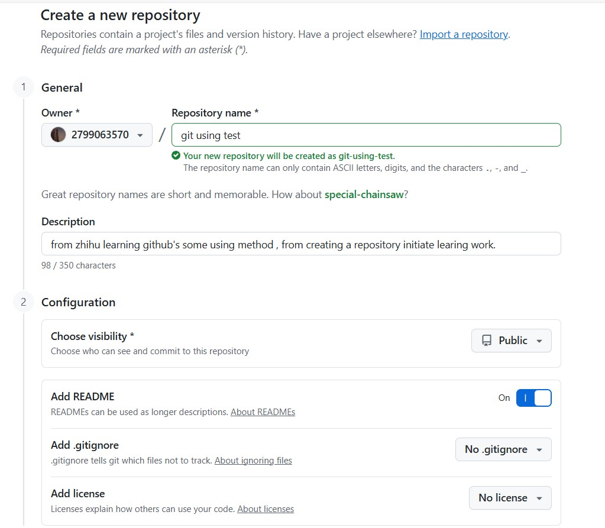
主要填写的有以下几点：

1. **Repository name**: 仓库名字，必须是`用户名.github.io`格式
2. **Description**: 仓库描述，可以不填（内容初始为README）
3. **Public/Private**: 选择公开版本
4. **README**: 勾选初始化README文件
5. **.gitignore**是用来忽略一些文件的，例如编译生成的文件、日志文件等。
6. **License**是用来指定代码的许可证的，例如MIT、GPL等

---

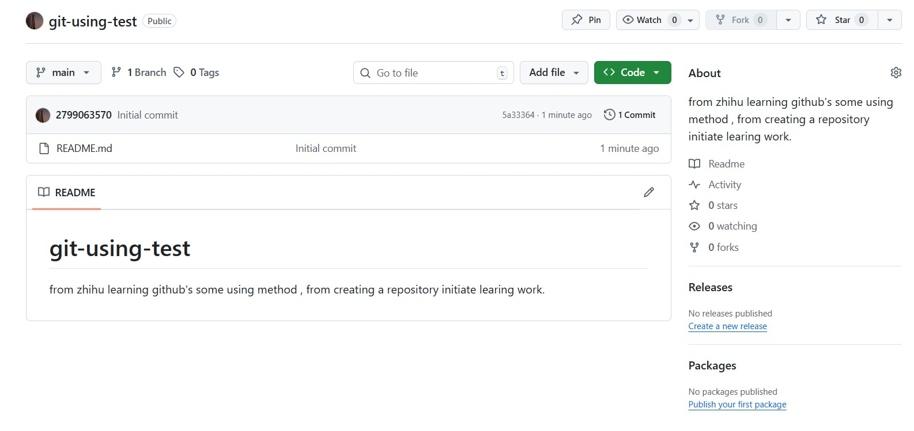
如图> 仓库创建完成 , 完成了仓库的创建。
仓库名为 git-using-test ，包含 1 个commit，该commit(第一个 commit) 是我们通过勾选Initialize this repository with a README，创建了一个初始化提交文件README.md；包含 1 个branch，为main分支，即主分支。

## 二、Github 一些术语

- **Repository**：简称Repo，**可以理解为“仓库”**，我们的项目就存放在仓库之中。也就是说，如果我们想要建立项目，就得先建立仓库；有多个项目，就建立多个仓库。
- **Issues**：**可以理解为“问题”**，举一个简单的例子，如果我们开源一个项目，如果别人看了我们的项目，并且发现了bug，或者感觉那个地方有待改进，他就可以给我们提出Issue，等我们把Issues解决之后，就可以把这些Issues关闭；反之，我们也可以给他人提出Issue。
- **Star**：**可以理解为“收藏”**，当我们感觉某一个项目做的比较好之后，就可以为这个项目点赞，而且我们点赞过的项目，都会保存到我们的Star之中，方便我们随时查看。在 GitHub 之中，如果一个项目的点星数能够超百，那么说明这个项目已经很不错了。
- **Fork**：可以理解为“拉分支”，如果我们对某一个项目比较感兴趣，并且想在此基础之上开发新的功能，这时我们就可以Fork这个项目，这表示**复制一个完成相同的项目到我们的 GitHub 账号之中，而且独立于原项目**。之后，我们就可以在自己复制的项目中进行开发了。
- **Pull Request**：可以理解为“提交请求”，此功能是建立在Fork之上的，如果我们Fork了一个项目，对其进行了修改，而且感觉修改的还不错，我们就可以对原项目的拥有者提出一个Pull请求，等其对我们的请求审核，并且通过审核之后，就**可以把我们修改过的内容合并到原项目之中**，这时我们就成了该项目的贡献者。
- **Merge**：可以理解为“合并”，如果别人Fork了我们的项目，对其进行了修改，并且提出了Pull请求，这时我们就可以对这个Pull请求进行审核。如果这个**Pull请求的内容满足我们的要求，并且跟我们原有的项目没有冲突的话，就可以将其合并到我们的项目之中**。当然，是否进行合并，由我们决定。
- **Watch**：**可以理解为“关注该项目”**，如果我们Watch了一个项目，之后，如果这个项目有了任何更新，我们都会在第一时候收到该项目的更新通知。
- **Gist**：如果我们没有项目可以开源或者只是单纯的想分享一些代码片段的话，我们就可以选择Gist。不过说心里话，如果不翻墙的话，Gist并不好用。

## 三、Github 克隆clone与下载download

**克隆**是指将GitHub上的远程代码库完全复制到本地计算机中。用户通过Git命令行工具或Git GUI工具执行这一操作，可以获取到完整的代码仓库以及其版本历史。
步骤如下：

1. 打开终端
2. 输入克隆指令 `git clone <仓库的URL>` 例如：`git clone https://github.com/QueChan/git-using-test.git`
3. 克隆操作完成后，本地会创建一个与远程相同的代码仓库文件夹

**下载**是指直接将GitHub上的项目文件以压缩包的形式下载到本地。与克隆不同，下载的内容仅为项目的最新版本，而不包括其历史版本。
步骤如下：

1. 访问GitHub项目页面：在浏览器中打开目标项目的GitHub页面。
2. 点击下载按钮：在项目页面，通常可以找到“Code”按钮，点击后选择“Download ZIP”。
3. 解压缩文件：下载完成后，将压缩文件解压到本地计算机中。

## 四、Git的使用

GitHub 是基于版本控制系统 Git 之上的，如果我们想要进行代码托管，想要进行团队协作，这都少不了一个工具，那就是：Git。
接下来介绍 Git 的命令操作，包含 init、add 等，在 Git 中，所有的命令都是以git开头，例如，`git init`其作用就是初始一个 Git 仓库。
需要注意的是在我们进行任何的git操作之前，我们都得先切换到 Git 的仓库目录。

我们在仓库中打开 git bash，下面进行相关的操作演示

### 1. git status

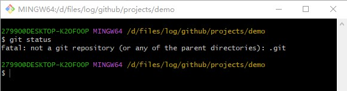
`git status`命令的作用是查看当前仓库的状态，例如哪些文件被修改，哪些文件被暂存等。如上图所示，结果显示demo不是一个 Git 仓库，这是很正常的反应，因为我们还没有在计算机中声明demo为 Git 仓库。

### 2. git init

对终端输入`git init`，即可初始化一个 Git 仓库。这时候我们再输入`git status`, 来查看仓库的状态。
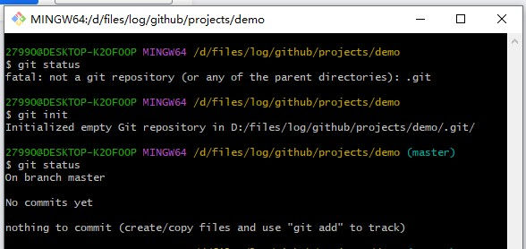
demo目录已经成为一个 Git 仓库了，并且默认进入 Git 仓库的master分支，即主分支。

### 3. git add

我们创建一个test.txt文件，使用指令`git add test.txt`，即可将test.txt文件添加到暂存区。再输入`git status`来查看仓库的状态。
同时可以使用`git add .`将所有文件添加到暂存区。
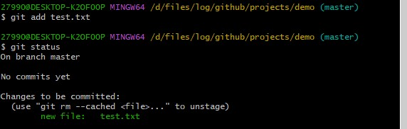
这说明文件test.txt已经被添加到 Git 仓库了，而在我们没有进行git add操作之前，文件test.txt并不被 Git 仓库认可，因此才会出现提示初始化仓库为空的现象。在这里，需要声明一点，那就是：**git add命令并没有把文件提交到 Git 仓库，而是把文件添加到了「临时缓冲区」**，这个命令有效防止了我们错误提交的可能性。

### 4. git commit

`git commit`命令将暂存区内容添加到本地仓库中，同时也会生成一个提交记录，记录下提交的时间、提交人、提交信息等。
指令格式为：
`git commit -m [message]`，[message]为提交信息，用于描述本次提交的内容。
`git commit [file1] [file2] ... -m [message]`提交暂存区的指定文件到仓库区
`git commit -a`参数设置修改文件后不需要执行 git add 命令，直接来提交
例如输入`git commit -m "text commit"`命令，将test.txt文件提交到 Git 仓库
提交完成之后，我们再输入`git status`来查看仓库的状态。
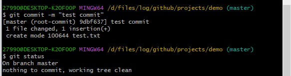
这说明文件test.txt已经被提交到 Git 仓库了，并且在提交信息中显示了我们输入的提交信息：text commit。且结果显示nothing to commit, working tree clean，这表示已经没有内容可以提交了，即全部内容已经提交完毕。

### 5. git log

输入`git log`命令，可以查看 Git 仓库的提交历史记录。
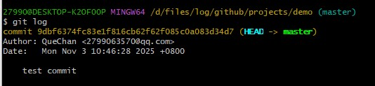
如上图所示，显示了我们的提交记录，提交记录的内容包括Author提交作者、Date提交日期和提交信息。通过q可以退出查看提交记录。

### 6. git branch

- 输入`git branch`命令，查看 Git 仓库的分支情况
- 输入`git branch -a`命令，查看所有分支，包括本地分支和远程分支。
- 输入`git branch -r`命令，查看远程分支。
- 输入`git branch <new_branch>`命令，创建一个新的分支new_branch。
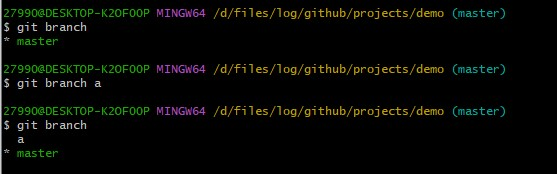
如上图所示，显示了仓库demo中的分支情况，现在仅有一个master分支，其中master分支前的`*`号表示“当前所在的分支”，例如`* master`就意味着我们所在的位置为demo仓库的主分支。输入命令`git branch a`，再输入命令`git branch`命令查看, 我们创建了一个名为a的分支。

- 输入`git branch -d a`命令，删除分支a。
- 输入`git branch -D a`命令(强行删除)。
  
需要注意的是，只有当分支a中的内容都被合并到其他分支之后，分支a才会被成功删除。如果分支a中还有未合并的内容，输入`git branch -d a`命令是会失败的。如果我们确定要删除分支a，而不管其中是否有未合并的内容，可使用强行删除。


### 7. git checkout

输入`git checkout a`命令，**切换到a分支**。
也可以在**创建分支的同时，直接切换到新分支**，命令为`git checkout -b`，例如输入`git checkout -b b`命令
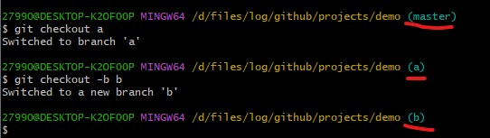

### 8. git merge

切换到master分支，然后输入`git merge a`命令，将a分支合并到master分支
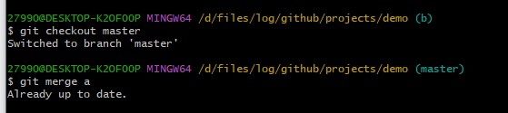

### 9. git tag

输入`git tag v1.0`命令，为当前分支打上标签v1.0。标签的作用是方便我们对某一个版本进行标记，方便我们日后查找和回滚。
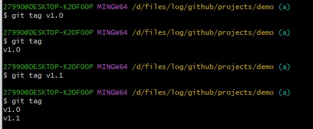
通过命令git tag即可查看标签记录，通过命令`git checkout v1.0`即可切换到该标签下的代码状态。
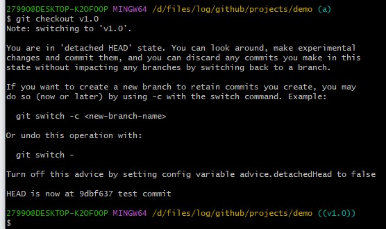

### 10. git remote

git remote 命令用于**管理 Git 仓库中的远程仓库**

- **git remote**：列出当前仓库中已配置的远程仓库（名称）
- **git remote -v**：列出当前仓库中已配置的远程仓库，并显示它们的 URL
- **git remote add <remote_name> <remote_url>**：添加一个新的远程仓库。指定一个远程仓库的名称和 URL，将其添加到当前仓库中
其他的指令我们可以参考菜鸟Git教程，主要是增删改查了

## 五、利用 SSH 完成 Git 与 GitHub 的绑定

现在无论是 GitHub，还是 Git，我们都是单独或者说是独立操作的，并没有将两者绑定啊！也就是说，我们现在只能通过 GitHub 下载代码，并不能通过 Git 向 GitHub 提交代码。
因此，下面我们就一起完成 Git 和 GitHub 的绑定，体验通过 Git 向 GitHub 提交代码的能力。不过在这之前，我们需要先了解 SSH（安全外壳协议），因为在 GitHub 上，一般都是通过 SSH 来授权的，而且大多数 Git 服务器也会选择使用 SSH 公钥来进行授权，所以想要向 GitHub 提交代码，首先就得在 GitHub 上添加 SSH key配置。

### 1. 生成 SSH Key

输入`ssh-keygen -t rsa`命令，表示我们指定 RSA 算法生成密钥，然后敲三次回车键，期间不需要输入密码，之后就就会生成两个文件，分别为id_rsa和id_rsa.pub，即密钥id_rsa和公钥id_rsa.pub. 对于这两个文件，其都为隐藏文件，默认生成在以下目录：

- Linux 系统：~/.ssh
- Mac 系统：~/.ssh
- Windows 系统：C:\Documents and Settings\username\\.ssh
- Windows 10 ThinkPad：C:\Users\think\.ssh

密钥和公钥生成之后，我们要做的事情就是把公钥id_rsa.pub的内容添加到 GitHub，这样我们**本地的密钥id_rsa**和 **GitHub 上的公钥id_rsa**.pub才可以进行匹配，授权成功后，就可以向 GitHub 提交代码啦！

### 2. 添加 SSH Key 到 GitHub

我们只需要将公钥id_rsa.pub的内容粘贴到Key处的位置（Titles的内容不填写也没事），然后点击Add SSH key 即可。
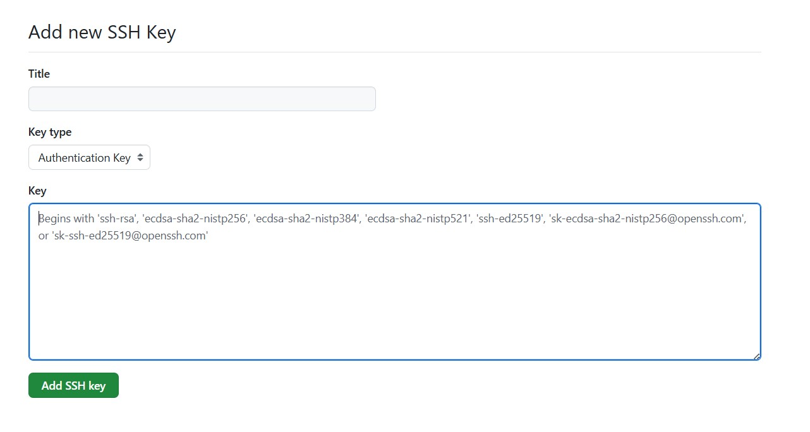
我们可以通过在 Git Bash 中输入`ssh -T git@github.com`进行测试
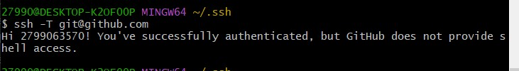

### 3. 通过Git将代码提交到Github

到这一步我们已经完成了本地 Git 与远程 GitHub 的绑定，这意味着我们已经可以通过 Git 向 GitHub 提交代码
我们需要先了解两个命令，也是我们在将来需要经常用到的两个命令，分别为 push 和 pull

- **push**：该单词直译过来就是“推”的意思，如果我们本地的代码有了更新，为了保持本地与远程的代码同步，我们就需要把本地的代码推到远程的仓库，指令为`git push origin master`
- **pull**：该单词直译过来就是“拉”的意思，如果我们远程的代码有了更新，为了保持本地与远程的代码同步，我们就需要把远程的代码拉到本地，指令为`git pull origin master`

此外，在之前我们讲到过pull request，在这里，估计大家就能更好的理解了，它表示：如果我们fork了别人的项目（或者说代码），并对其进行了修改，想要把我们的代码合并到原始项目（或者说原始代码）中，我们就需要提交一个pull request，让原作者把我们的代码拉到 ta 的项目中，至少对于 ta 来说，我们都是属于远程端的。

对于向远处仓库（GitHub）提交代码，我们可以细分为两种情况

#### 1. 本地没有 Git 仓库

这时我们就可以直接将远程仓库clone到本地, 其本身就是一个 Git 仓库了，**不用我们再进行init初始化操作啦，而且自动关联远程仓库**。我们只需要在这个仓库进行修改或者添加等操作，然后commit即可。
以知乎中CSBook的例子，我们进入他的项目页面。

复制上图所示的地址链接。然后，进入我们准备存储 Git 仓库的目录，例如下面我们新建的project目录， 从此目录进入 Git Bash：
执行以下指令，即可将CSBook项目clone到本地

``` URL
git clone https://github.com/2799063570/CSBook.git
```


至此，我们将Github中的项目clone到本地。
为了接下来的测试，我们在本地的项目中添加两个新的文件夹，分别为src和web。通过指令`git status`查看仓库的状态。
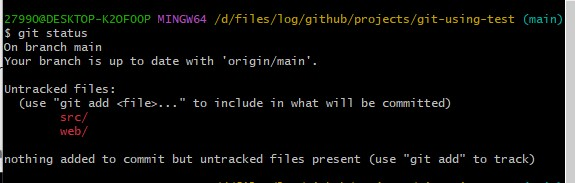
如上图所示，显示了我们新添加的两个文件夹src和web，并且这两个文件夹均处于未暂存状态。接下来，我们依次执行以下指令，将这两个文件夹提交到 Git 仓库中。
通过指令：``git add src`` 和 ``git add web``
``git commit -m "first commit"``
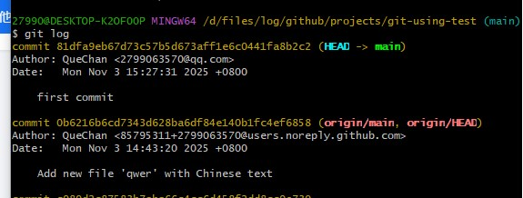
下面，我们将本地仓库的内容push到远程仓库，输入`git push origin main`命令
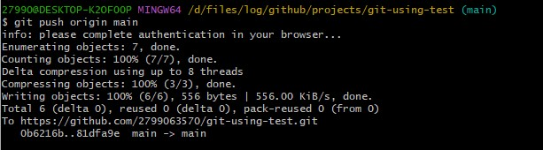
在Github上可以看到，我们的仓库更新了

#### 2. 本地已经有 Git 仓库

先建立Github仓库的关联：
通过使用`git remote add origin https://github.com/2799063570/demo.git` 命令，将本地仓库与远程仓库关联起来。
输入`git pull origin mian`命令，同步远程仓库和本地仓库
这个期间可能会出现错误，如`fatal: refusing to merge unrelated histories`，这是因为两个没有共同历史记录的 Git 分支时（比如本地新建的仓库首次拉取远程仓库，或两个独立创建的仓库合并）
这个时候我们可以使用在尾部加上`--allow-unrelated-histories`强制 Git 合并这两个不相关的历史记录。因此输入的指令为`git pull origin main --allow-unrelated-histories`

待问题解决后，我们重新pull，来同步远程和本地仓库
待同步完成之后，我们输入`git push origin main`命令，将本地仓库的内容推送到远程仓库。
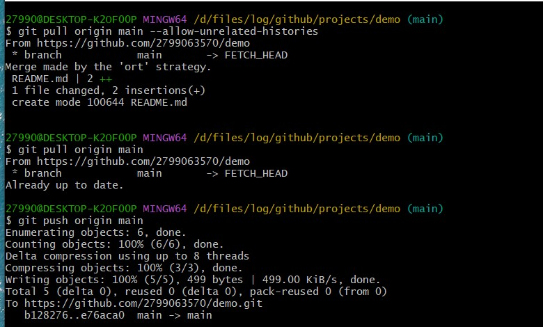

## 六、理解Github的分支结构

该部分主要参照于[https://juejin.cn/post/7207263350488907813]

首先，我们需要先了解git是如何帮助我们保存信息的。git每次存储操作时，保存的不是文件的变化或者差异，而是存储那一时刻的快照。
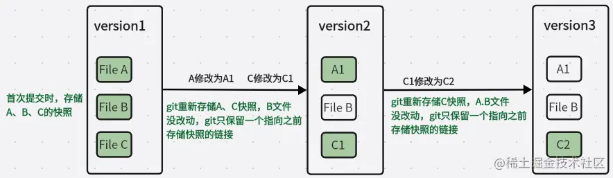
如图所示，经过两次存储，可以看到每次存储都是保存的文件的快照链接。
而分支则本质上仅仅是指向提交对象的可变指针，当我们进行多次分支提交时，指针会随着提交向前移动。箭头指向上一次提交
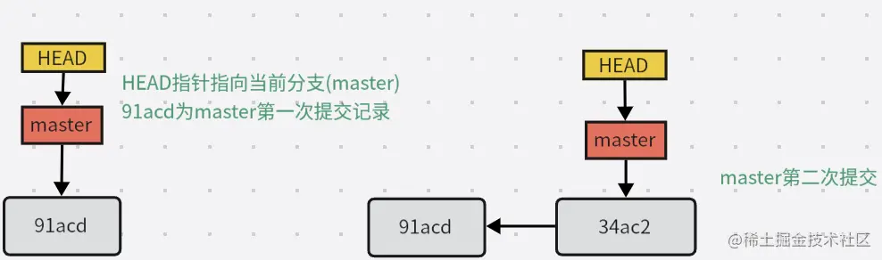
而创建分支，其实就是创建一个可以移动的新指针
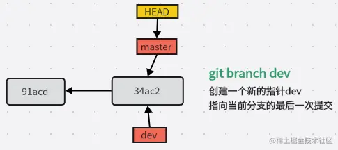
切换分支，则是HEAD游标指向到要切换的分支(dev)
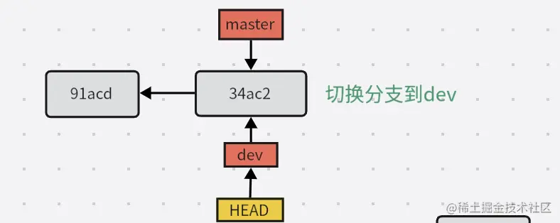
当前分支修改后提交，执行存储

我们在dev进行了一些提交操作后，现在需要把dev的分支内容合并到master，merge合并操作，会将两只分支的最新快照（74jck和87dd3）合并，并与二者的最近的共同祖先（34ac2）进行三方合并，生成一个新的提交(9913f)，且当前分支指针指向这个提交，如下图
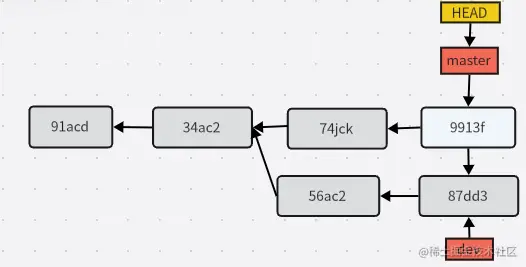
